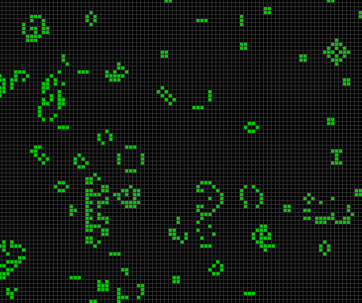

# Клеточные автоматы

Модель работы простейших клеточных автоматов на программном уровне, где все 3 условия работы создаются самим пользователем (наблюдающим или, как некоторые любят называть - Богами для компьютерной цивилизации).  

## Содержание

1. [Введение](./README.md#1-введение)
   * [Идея](./README.md#идея)
   * [История](./README.md#история)
   * [Смысл](./README.md#смысл)
   * [Суть проекта](./README.md#суть-проекта)
2. [Теоретическое описание](./README.md#2-теоретическое-описание)
    * [Основные концепции](./README.md#основные-концепции)
    * [Используемые технологии](./README.md#используемые-технологии)
    * [Практическая значимость](./README.md#практическая-значимость)
    * [Методы оценки работы](./README.md#методы-оценки-работы)
3. [Практическое описание](./README.md#3-практическая-описание)
   * [Структура репозитория](./README.md#структура-репозитория)
   * [Описание элементов программы и запуск](./README.md#описание-элементов-программы-и-запуск)
   * [Правила игры](./README.md#правила-игры)
   * [Лицензии](./README.md#лицензии)
4. [Заключение и выводы](./README.md#4-заключение-и-выводы)
5. [Полезные ссылки и источники](./README.md#5-полезные-ссылки-и-источники)

---

 

## 1 Введение

Клеточные автоматы - тема, которую плотненько придется изучить на 2-м курсе бакалавриата. Суть клеточных автоматов на данный момент лично мне не совсем ясна, но принцип работы понятен: задать условия существования, условия продолжения (движения или размножения, если будет угодно), условия смерти. Простейшее моделирование. 
Впервые с клеточными автоматами я столкнулся в старшей школе, когда, посетив одно из дополнительных теоретических занятий своего учителя по информатике. Тогда всем присутствующим была представлена необычная игра, которая называлась просто - "Игра в жизнь". Сутью игры было не столько поиграть, сколько понаблюдать. Да-да, всего лишь понаблюдать, как было показано в какой-то короткометражке про Бога и развитие человечества. Учитель запустил на большом экране сайт, на котором как раз все это и моделировалось. Примерно так лично я и познакомился с теорией клеточных автоматов.

### Идея

### История

### Смысл

### Суть проекта

---

## 2 Теоретическое описание

### Основные концепции

### Используемые технологии

### Практическая значимость

### Методы оценки работы

---

## 3 Практическая описание

### Структура репозитория

Структуру репозитория можно разделить на несколько частей: программную, документальную и вспомогательную.
**Подробнее:**

1. Программная часть репозитория располагается, очевидно, в директории [./src](./src/) и хранит в себе python файлы, необходимые для начала и запуска программы. В свою очередь, если рассматривать директорию изнутри, то имеется заголовочный файл [main.py](./src/main.py), в котором и происходит запуск программы и импорт необходимых для моделирования системы функций и библиотек. Для запуска программы моделирования необходимо запустить файл [main.py](./src/main.py) в терминале, либо же воспользовавшись встроенными в некоторые IDE (таких как PyCharm, к примеру) функциями запуска программы.

### Описание элементов программы и запуск

### Правила игры

### Лицензии

Репозиторий распространяется под открытой лицензией общего доступа - MIT. 
С файлом лицензии можно ознакомиться [по ссылке](./LICENSE.txt).

Кратко: Лицензия MIT позволяет распространять открытый исходный код к проектам, но без обязательства поддерживать его, без обязательства предоставлять гарантию безопасности кода и с возможностью не указывать авторство при копировании или распространении ссылки или ресурсов из этого проекта.

Лицензия MIT в проекте моделирования клеточных автоматов используется формально. 
Фактически никто не станет преследовать человека за использование и распространение кода, элементов кода или прочих ресурсов, содержащихся в этом репозитории.

---

## 4 Заключение и выводы

---

## 5 Полезные ссылки и источники

1. ["Клеточный автомат" - ru.wikipedia.org](https://ru.wikipedia.org/wiki/Клеточный_автомат)
2. ["10 удивительно зрелищных простейших клеточных автоматов" - habr.com](https://habr.com/ru/articles/718620/)

  

###### 25.06.2025